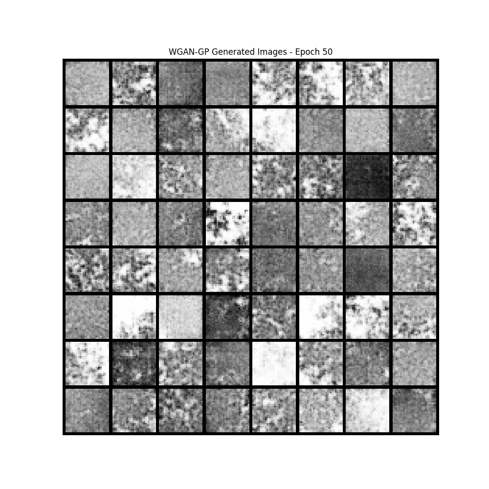

# WGAN-GP for MedMNIST Generation

A Wasserstein Generative Adversarial Network with Gradient Penalty (WGAN-GP) implementation for generating medical images from the MedMNIST dataset.

## Features

- 🏥 Trained on PathMNIST (can be adapted to other MedMNIST variants)
- ⚡ GPU-accelerated training with PyTorch
- 📊 Comprehensive evaluation metrics (Inception Score, FID)
- 📈 Training monitoring with TensorBoard
- 💾 Automatic checkpointing and sample generation

## FID 44.654
## INCEPTION SCORE 	6.08 ± 8.23
